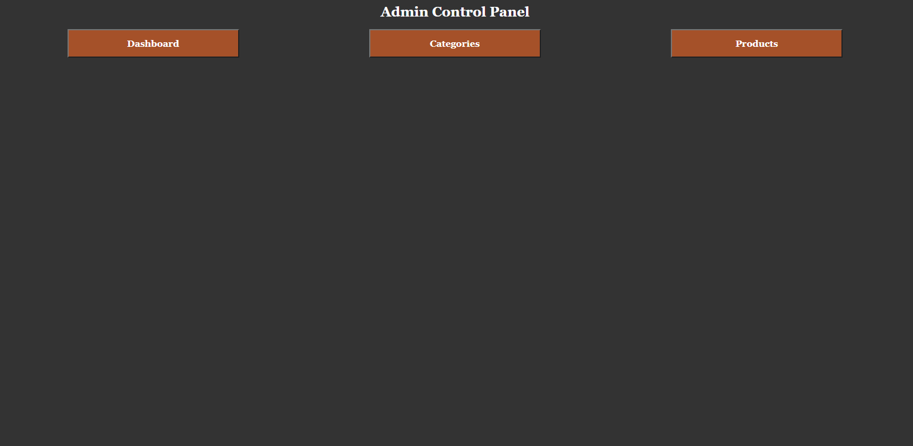
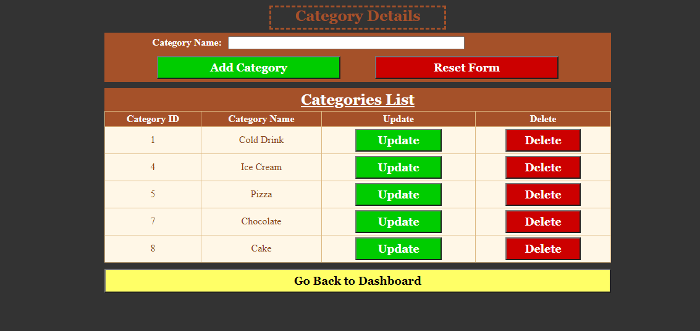

# ASP.NET: CRUD v4

- This is even more complex and upgraded CRUD in ASP.NET
- This time it is a gimmick of Admin Dashboard
- Admin can add categories and according to that categories, add products in another page
- All the categories added in Categories page bind to DropDownList in Products Page
- We cannot delete a category if it has product of its type in the System!

# Screenshots

  <h2> Dashboard </h2>
   
  <h2> Categoeries </h2>
   
  <h2> Products </h2>
  

